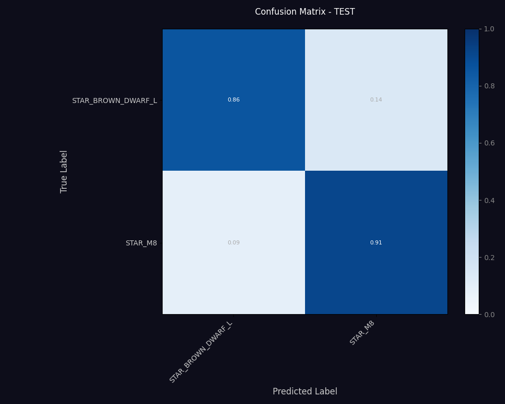
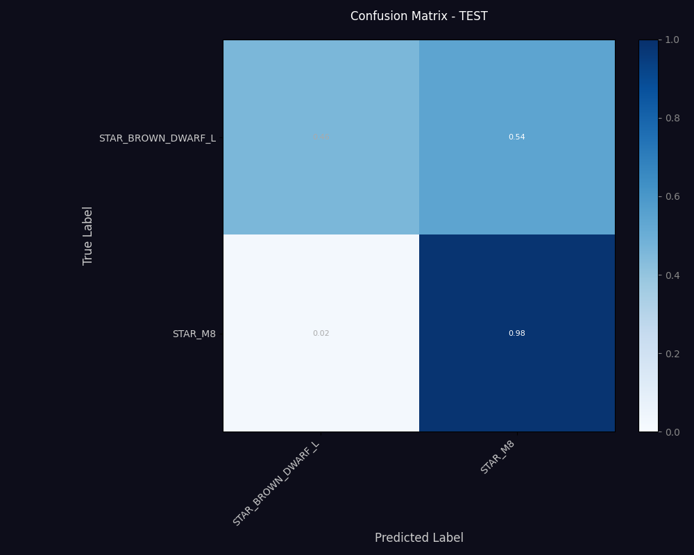
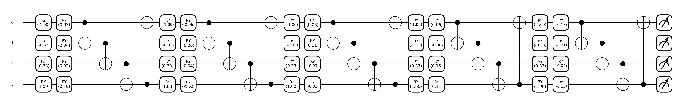
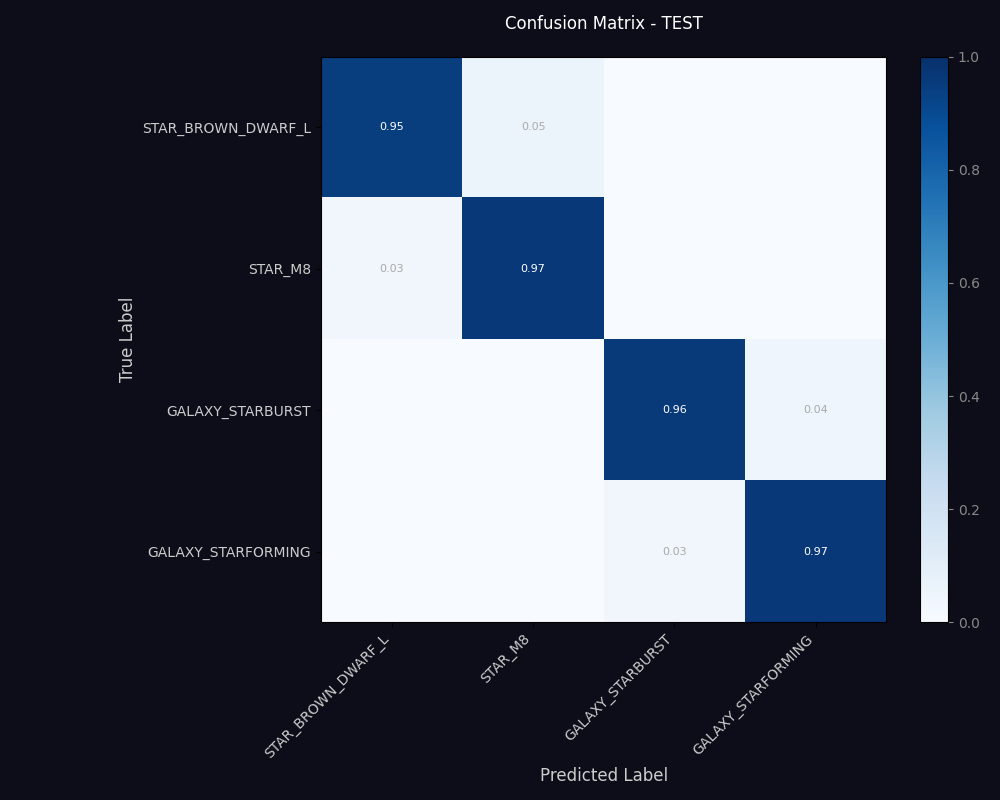
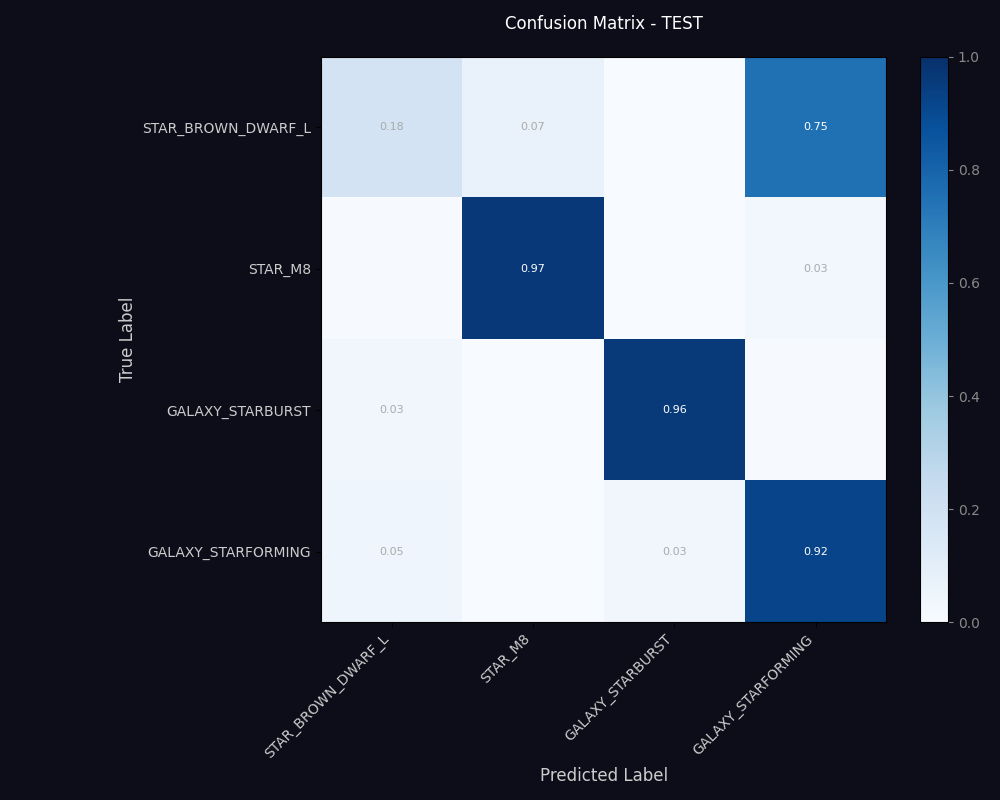

# Quantum ML for SDSS Spectral Classification — Progress Report

**Goal:** Compare a Variational Quantum Circuit (VQC) against parameter-matched classical baselines on hard, hand-picked SDSS classification tasks.

---

## Part 1 — Binary task: STAR_BROWN_DWARF_L vs STAR_M8

This is the single hardest confusion pair from our previous full-class confusion-matrix analysis (~30% combined overlap). We use it as a stress test.

### Setup

To make the comparison fair, both models share the exact same architecture **except the middle layer**:

```
flux → SpectralFeatureExtractor (CNN, ~24K params, trainable)
     → bottleneck to 4 features
     → [ MIDDLE: VQC (72 params)  OR  Linear MLP (76 params) ]
     → Linear(4, 32) → ReLU → Linear(32, 2) → logits
```

The "Classical Mirror" is a **dequantized** version of the quantum model: I replace the 4-qubit, 6-layer angle-encoding circuit with a tiny classical MLP that has the same parameter count (76 params vs 72). Everything else — extractor, head, training loop, seeds, data — is bit-for-bit identical. This isolates the comparison to **VQC vs MLP at equal parameter budget**.

### Results

| Model | STAR_BROWN_DWARF_L | STAR_M8 |
|---|---|---|
| Quantum (angle encoding) | **86%** | **91%** |
| Classical Mirror (MLP) | 46% | 98% |

The classical mirror **collapsed** onto the easier class — it learned to predict STAR_M8 for almost everything, including 54% of the actual brown dwarfs. The quantum model classified both classes well with no collapse.

### Confusion matrices

**Quantum (angle encoding):**


**Classical Mirror (same architecture, MLP instead of VQC):**


### Comments

So from last time what I did was instead of using a VQC and comapring it against a huge CNN we used for the 62 classes I instead went ahead and built a classical solution with 76 parameters.

So the VQC has 72 parameters and the classical mirror has 76 parameters. The classical mirror is a tiny MLP that has the same number of parameters as the VQC. The rest of the architecture is the same for both models, including the feature extractor and the head.

This should make for a fair comparison between the two models, as they have the same number of parameters and the same architecture except for the middle layer. The results show that the quantum model performs much better on this hard binary task than the classical mirror, which collapsed onto the easier class.


---

## Part 2 — Experiment 3: 4-class task with a Frozen Beast Extractor

### Motivation

Part 1 showed VQC > matched classical at small param counts on a hard binary task. The next question: can a tiny VQC match a much bigger classical network on a harder, multi-class task, when both share a strong pretrained feature extractor?

### Setup

- **4 classes** drawn from our hardest confusion pairs:
  `STAR_BROWN_DWARF_L`, `STAR_M8`, `GALAXY_STARBURST`, `GALAXY_STARFORMING`
- **1000 samples per class**, balanced.
- A pretrained classical CNN-Transformer (the **"Beast"**, ~14M params, ~84% accuracy on the full 62-class problem) is **frozen** and used purely as a 128-dim feature extractor — its final classifier layer is replaced with Identity.
- All three contenders below share this frozen Beast. Only the **head** differs.

### Models — `src/models/exp3_models.py`

1. **`FrozenBeastExtractor`** (shared)
   Loads the pretrained Beast checkpoint, swaps its final `Linear(128, 62)` for `nn.Identity`, freezes every parameter, and locks BatchNorm in eval mode. Output: a 128-dim feature vector per spectrum. Zero trainable parameters.

2. **`FrozenBeastDenseClassifier`** — the **classical baseline**
   A simple two-layer MLP head on top of the frozen 128-d Beast features:

   ```
   128-d Beast features
     → Linear(128, 38)   →  weights 128·38 = 4 864  + bias 38   = 4 902 params
     → ReLU              (no params)
     → Dropout(p=0.2)    (no params)
     → Linear(38,  4)    →  weights 38·4   =   152  + bias  4   =   156 params
                                                               ─────────────
                                                Total trainable = 5 058 params
   ```

   The hidden width 38 was picked specifically to land near the 5 000-parameter target so the comparison against the ~556-param Hybrid VQC is a clean 10× ratio. ReLU gives non-linearity, Dropout regularises against overfitting on the small (4 × 700 = 2 800 train sample) dataset.

3. **`FrozenBeastVQCClassifier`** — the **hybrid quantum** model
   `Linear(128, 4) [bottleneck] → tanh·π → 4-qubit×5-layer VQC → Linear(4, 4) [readout]`. **~556 trainable params** (516 bottleneck + 20 VQC + 20 readout).

   The actual quantum circuit run inside that middle stage:

   

   Read left to right — 4 qubit lines, 5 repeating blocks. Each block is `RY (data re-upload) → RY (trainable rotation) → circular CNOT entanglement`, ending in a PauliZ measurement on every qubit. Only the trainable RY angles are learned (4 qubits × 5 layers = **20 parameters**); the data RY angles come from the bottleneck output, and the CNOT structure is fixed.

4. **`FrozenBeastTinyClassicalClassifier`** — the **parameter-matched control**
   Same shape as the hybrid but with NO quantum circuit: `Linear(128, 4) → tanh → Linear(4, 4) → ReLU → Linear(4, 4)`. **~556 trainable params.** This isolates whether the hybrid's success comes from the VQC itself or just from the 556-param structure.

### The story (in order of what we tried)

#### Attempt 1 — Pure VQC with a frozen random projection: **failed**
First we tried only a VQC and a frozen random matrix to compress 128 → 4. This destroyed almost all class-discriminating information before the qubits saw it: the quantum model was around chance on most classes (e.g. ~9% on GALAXY_STARFORMING) while the classical baseline hit 95%+. **Conclusion: 128 dims cannot be compressed to 4 qubits via a random matrix — you need a learnable bottleneck.**

#### Attempt 2 — Hybrid VQC (trainable bottleneck): **matches the classical**
Replacing the random projection with a trainable `Linear(128, 4)` lets gradient descent find the 4 directions the VQC actually needs. Result: the 556-parameter hybrid model hits the same accuracy as the 5058-parameter classical baseline on every class — roughly **10× fewer parameters for equal accuracy**.

#### Attempt 3 — Tiny classical at the same ~556 params: **fails**
To check whether the hybrid wins because of the VQC or because 556 params just happens to be enough, we built a same-sized purely-classical network with the identical bottleneck-and-readout shape but a classical layer in place of the VQC. It collapses — STAR_BROWN_DWARF_L drops to 18%, with 75% of brown dwarfs mispredicted as GALAXY_STARFORMING. **The VQC is doing real work in that middle layer.**

### Results

| Model | Trainable params | STAR_BROWN_DWARF_L | STAR_M8 | GALAXY_STARBURST | GALAXY_STARFORMING |
|---|---|---|---|---|---|
| Classical Dense | **5,058** | 95% | 97% | 96% | 97% |
| **Hybrid VQC** | **556** | 95% | 96% | 96% | 97% |
| Tiny Classical (same size as hybrid) | 556 | **18%** | 97% | 96% | 92% |

### Confusion matrices

**Classical Dense (5,058 params):**


**Hybrid VQC (556 params):**


**Tiny Classical control (556 params, same size as hybrid):**


# Comments

Basically what was said above. So first I noticed 128 -> 4 features impossible without a learnable bottleneck, then with the bottleneck the hybrid VQC matches the big classical, and then the tiny classical control fails, showing that the VQC is contributing real expressivity rather than just "having 556 parameters".

In the future I would like to try around with a few more parameters.

For example I tried to do 3D Rotations so in all axes not just Y, which lead to having 40 more parameters in the VQC so still under 600 but the result wasn't better in fact it got worse. So I think the 4-qubit 5-layer angle encoding circuit is already pretty expressive for this task, and adding more parameters to the VQC doesn't necessarily help.

Still I would like to try a few more variations on the VQC architecture, maybe some different ansatzes or encoding schemes, to see if we can get even better performance or if we can understand better why the VQC is doing so well in this setting.


### Takeaway

- A learnable classical bottleneck is **required** in front of any VQC operating on rich pretrained features — pure quantum compression of 128 → 4 destroys signal.
- With that bottleneck, **the hybrid VQC matches a 10× larger classical network** on a 4-class hard task.
- A classical control of the same total size **cannot reproduce that result**, so the parity is not just from "having 556 parameters" — the quantum circuit is contributing real expressivity in that small budget.

---

## Summary in one sentence

On hard SDSS confusion pairs, the angle-encoding VQC matches or beats parameter-matched classical baselines at small param counts, and as a hybrid head on a frozen feature extractor it achieves the same 4-class accuracy as a 10× larger classical network — a parameter-efficiency win attributable to the quantum circuit rather than to the surrounding architecture.
